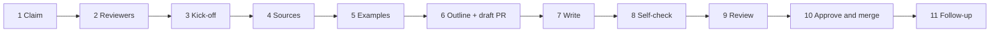

# Page choreography

These are the steps from picking up a page to getting it approved. Each step says **who** does it, **what** they do, **where** it is recorded, and **when it is done**. The timings are suggestions for a typical page. Chapter overview pages go faster; runtime scenarios and crosscutting concepts take longer.

| # | Step | Who | Typical effort |
|---|---|---|---|
| 1 | Claim the page | Owner | 5 min |
| 2 | Agree reviewers | Owner, with the architecture lead | 1 day |
| 3 | Kick-off | Owner + reviewers | 30 min |
| 4 | Gather sources | Owner | 1–3 hours |
| 5 | Look for examples and best practices | Owner | 1–2 hours |
| 6 | Outline and open a draft pull request | Owner | 1 hour |
| 7 | Write | Owner | 0.5–2 days |
| 8 | Self-check | Owner | 30 min |
| 9 | Review | Reviewers + specialists | 5 working days maximum |
| 10 | Approve and merge | Reviewer | 10 min |
| 11 | Follow-up | Owner | 15 min |

---

## 1. Claim the page

**Who:** the owner.

1. Check the [writing order](/handbook/writing-order): the waves this page depends on should be at least *in review*.
2. Open the page's issue: search for `[page] <page title>`, or filter by `label:page`.
3. **Assign the issue to yourself.**
4. On a new branch, set `owner: "@your-handle"` in the page's front matter.

**Done when:** the issue has an assignee.

## 2. Agree reviewers

**Who:** the owner, with the architecture lead.

1. Choose **one or two reviewers** from the taskforce who know the subject. At least one should have written or reviewed a neighbouring page (same chapter or same scope).
2. Check the page's `audience`. If it includes `dpo`, `security`, `legal` or `elsi`, and the page makes claims in that area, add the matching `needs-…` label to the issue. A specialist will then review it too.
3. Comment in the issue: *"Reviewers: @a, @b. Specialist review: DPO."* Ask them to confirm.
4. Set `reviewers: ["@a", "@b"]` in the front matter.

**Done when:** the reviewers have confirmed in the issue.

## 3. Kick-off

**Who:** the owner and the reviewers. A 30-minute call, or an exchange in the issue.

Agree on:

- **Scope:** which questions under *What this page must answer* are in, and which are out or belong to another page;
- **Key messages:** the two or three things a reader must take away. These become the *In short* box;
- **Open points:** anything that needs a decision from the architecture lead or the working group.

Write a short **scope note** as a comment in the issue: in scope, out of scope, key messages, open points.

**Done when:** the scope note is in the issue.

## 4. Gather sources

**Who:** the owner. See [Sources, examples and best practices](/handbook/sources-and-examples) for where to look.

1. **Read the governance sections** listed in the page's `governance_refs`. The [traceability page](/appendix/traceability) gives their titles. Find them by section number in the [published governance](https://zenodo.org/records/19096953) (the annex of GDI D2.4). Note, for each section, the responsibilities that affect the architecture.
2. **Check the legal acts** that apply to the page: the EHDS, the GDPR, the draft HealthData@EU implementing act, and NIS2 where relevant.
3. **Search the GDI, B1MG and B1MG+ deliverables** and other sources the page mentions.
4. **Add every source you will cite** to `src/data/sources.json`, with status `candidate` until the taskforce has checked it.
5. **List the sources in the issue** (one line each: what it says that matters for this page).

**Done when:** the source list is in the issue and the new sources are in `sources.json`.

## 5. Look for examples and best practices

**Who:** the owner.

1. Read the [page recipe](/handbook/recipes) for this type of page, and the arc42 guidance for the chapter.
2. Look for **one or two comparable solutions**: how other European health or research data infrastructures solve the same problem.
3. Note in the issue what you will reuse, and what doesn't fit Genome EDIC (and why).

**Done when:** examples and best practices are noted in the issue, even if the note is "none found".

## 6. Outline and open a draft pull request

**Who:** the owner.

1. Replace the placeholder content with the **headings from the recipe** and a first *In short* box.
2. Set `status: draft`.
3. Open a **draft pull request** that says `Refs #<issue number>`. Ask the reviewers for a quick look at the outline: 10 minutes, comments only.

Early feedback on the outline is cheaper than rewriting a finished page.

**Done when:** the reviewers have seen the outline (or 2 working days have passed).

## 7. Write

**Who:** the owner. Follow the [page recipe](/handbook/recipes) and the writing rules in `CONTRIBUTING.md`.

- **Start with the diagram or the table,** then explain it. Readers look at the picture first.
- **Cite as you go.** Each claim that comes from the governance gets `<GovRef id="…" />`, and each claim from another source gets `<Cite id="…" />`. List every governance section you implement in `governance_refs`.
- **Name the scope and the actor** for every component and every step.
- **Say what is not decided.** Use `:::caution[Open point]` for anything that still needs a decision, and add it to chapter 11 (Risks) through an issue.
- **Link, don't repeat.** If another page explains something, link to it.

If you use an AI assistant, give it `AGENTS.md`, the page file, and the sources you gathered. Check every claim and every citation it produces against the source. You remain the author.

**Done when:** every question in scope is answered.

## 8. Self-check

**Who:** the owner.

- [ ] The *In short* box has at most three bullets that a non-specialist understands.
- [ ] Every question in the scope note is answered, or explicitly moved to another page.
- [ ] `governance_refs` lists every governance section the page implements.
- [ ] Every scope, actor and governance term matches the glossary. Its first mention on the page links to its glossary entry, and the first use of each acronym is linked with `<Acronym>`.
- [ ] Open points are marked and have an issue.
- [ ] `npm run check` and `npm run build` pass. You checked the page in the local preview (`npm start`).
- [ ] **Reader test:** give the page to someone outside the subject, or to an AI assistant with no other context, together with the questions from the page's reader guides. Fix what they got wrong.

**Done when:** all boxes are ticked.

## 9. Review

**Who:** the owner starts it; the reviewers and specialists do it.

1. Set `status: in-review`, mark the pull request *Ready for review*, and change `Refs` to `Closes #<issue number>`.
2. Request the reviewers on the pull request.
3. Reviewers use the [review checklists](/handbook/review-checklists) and comment within **5 working days**.
4. The owner answers every comment: either changes the text, or explains why not.
5. **Two review rounds at most.** If owner and reviewer still disagree, the architecture lead decides. If the disagreement is about the architecture itself, the decision becomes an ADR.

**Done when:** every review conversation is resolved.

## 10. Approve and merge

**Who:** a reviewer.

1. On the pull request branch, set `status: approved` and `last_reviewed: <today>`, and commit.
2. Approve the pull request. Once CI passes, merge it. This closes the issue.

**Done when:** the pull request is merged. The page shows *Approved* on the site.

## 11. Follow-up

**Who:** the owner.

- **New questions or gaps** found while writing: open an issue for each (template *Page task* or *Reader question*).
- **Decisions taken** during writing or review: make sure each has an ADR.
- **Reader guides:** if the page answers a question that isn't in the guides yet, add it to the matching guide.
- **Tell the taskforce** in the regular meeting or channel that the page is approved, so that pages in the next wave can build on it.

**Done when:** the follow-up issues exist.
