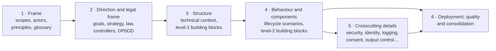

# Writing order

Pages are written in six **waves**. Each wave builds on the words and decisions of the waves before it, so that we don't write the same thing twice or contradict ourselves.

## Rules

1. **A wave can start when the pages of the waves it depends on are at least *in review*.** It doesn't need to wait for their approval. If a later page shows that an earlier one is wrong, open an issue for the earlier page. Don't work around it silently.
2. **Inside a wave, pages are independent** and can be written in parallel. Wave 4 is the largest (about 30 pages). The European, national and User Organisation scope teams work on it at the same time.
3. **ADRs are written whenever a decision is taken,** in any wave. Chapter 9 is never "finished".
4. **The architecture lead can move a page to another wave.** Change `wave` in its front matter and explain why in the page's issue.

## Why this order

- **Wave 1 fixes the vocabulary and the boundaries.** Every other page talks about scopes and actors. If 3.3 and 3.1 are unclear, every page after them will be unclear too.
- **Wave 2 fixes the direction.** The legal constraints, the solution strategy and the controller/processor map (8.2) decide what is allowed. Data protection by design and default (8.1) comes this early because it shapes every component and scenario.
- **Wave 3 draws the outline** that wave 4 fills in.
- **Wave 4 describes behaviour and components together.** A scenario in chapter 6 and the components it uses in chapter 5 inform each other, so their owners should talk.
- **Wave 5 details the concepts** that waves 3 and 4 have already referenced. This avoids writing abstract concepts nobody uses.
- **Wave 6 consolidates:** deployment, measurable quality scenarios, risks, and a final check that every question in the reader guides has an answer.

## Progress per wave

Generated from the `wave` and `status` fields of each page.

<WritingOrder />
